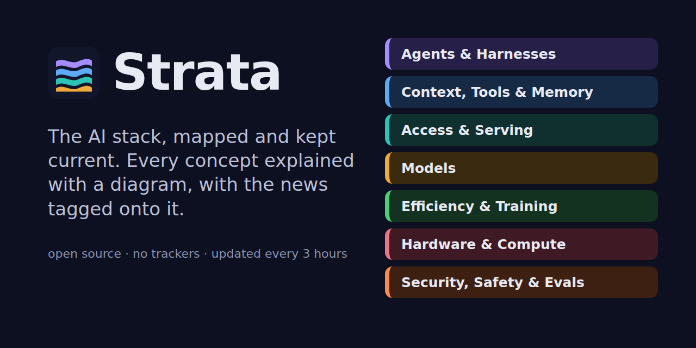
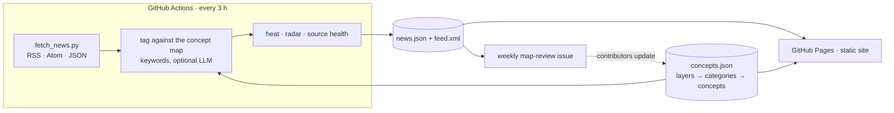

<p align="center">
  
</p>

<h1 align="center">Strata</h1>

<p align="center"><strong>The AI stack, mapped and kept current.</strong><br>
Every model, tool, technique and chip on one layered map, each explained with a diagram,<br>
with the latest news tagged onto it every three hours.</p>

<p align="center">
  <a href="https://hmussana.github.io/Strata/"><strong>Open the site →</strong></a> ·
  <a href="https://hmussana.github.io/Strata/feed.xml">Atom feed</a> ·
  <a href="CONTRIBUTING.md">Contribute</a>
</p>

---

> **The homepage is now The AI Stack:** a visual, zoomable explainer of nine layers (landscape → stack → layer →
> concept, at depths from "story" to "frontier"). Its content model is documented in
> [docs/content-model.md](docs/content-model.md). Pages marked draft haven't had a human review yet. The seven-layer
> news map described below lives on at [`/latest/`](https://hmussana.github.io/Strata/latest/); old `#c=` and `#l=`
> links and `/next/` links redirect automatically.

## Why

Newsletters and feeds tell you *what* happened. They rarely tell you *where it fits*. If you work with LLMs, it is easy to feel permanently behind: new frontier models, agent harnesses, quantisation formats, desktop AI boxes, routers and protocols every week.

Strata is a map first and a news board second. Every story lands on a concept, and every concept sits on a layer, so a headline like "new 4-bit MoE runs on a DGX Spark" becomes three things you can click: *quantisation* (L2), *mixture of experts* (L3) and *desktop AI machines* (L1).

## The Strata Model: an OSI model for AI

| # | Layer | ≈ OSI | What moves | Example threat |
|---|---|---|---|---|
| 7 | **Agents & Apps** | Application | goals & tasks | excessive agency, the lethal trifecta |
| 6 | **Tools & Protocols** | Presentation | tool calls (JSON, MCP) | tool poisoning, injection via tool output |
| 5 | **Context & Memory** | Session | context windows | RAG and memory poisoning |
| 4 | **Inference & Access** | Transport | token streams | exposed inference servers, key leakage |
| 3 | **Models** | Network | tokens → predictions | jailbreaks, backdoors |
| 2 | **Weights & Numerics** | Data link | tensors & bytes | malicious model files |
| 1 | **Compute** | Physical | FLOPs & bytes/second | GPU memory leakage |

Security, safety and governance run across all seven. Remember it top-down: **A**ll **T**ools **C**an **I**nvoke **M**odels **W**ith **C**ompute.

<p align="center"></p>

## What's inside

| | |
|---|---|
| **The tower** | The seven layers at a glance, each with its key technologies and threats (toggle *Technologies / Threats / Both*). Click a layer for a plain-words explanation, a diagram, threat cards with real examples and defences, and every concept on that layer. |
| **Follow a prompt** | An animated walkthrough of one request travelling down the stack to the silicon and back up as an answer. |
| **Learning paths** | Guided sequences such as *Run models locally*, *Understand agents*, *Pick the right model*, *Secure AI systems* and *Ground models in your data*, with progress saved in your browser. |
| **News board** | About 25 sources: lab blogs, Hacker News, r/LocalLLaMA, Hugging Face papers, arXiv, respected newsletters, tech press, AI-security research and release notes. Stories are auto-tagged onto the map; filter by layer, source type and time window, or show only stories *new since your last visit*. |
| **Trending & Radar** | Which concepts are heating up this week versus last, and a **Radar** of terms trending across several sources that the map doesn't cover yet. A weekly workflow turns the Radar into a GitHub issue, so the map keeps pace with the field. |
| **Atom feed** | The tagged stream is published at `/feed.xml` for any feed reader. |

## Principles

- **Zero third-party requests.** No CDNs, web fonts, analytics or cookies. The page ships a strict Content-Security-Policy (`default-src 'self'`) and `no-referrer`.
- **Zero dependencies.** Plain HTML, CSS and ES modules; the fetcher is standard-library Python. There is nothing to `npm install` and nothing to audit but this repo.
- **Private by default.** "Learned" marks and your last-visit time live only in your browser's `localStorage`.
- **Hardened automation.** GitHub Actions are pinned to commit SHAs with least-privilege permissions per job; feed responses are size-capped, links are restricted to `http(s)`, and feed text is escaped everywhere it is rendered.

## How it works



## Run it yourself

```bash
git clone https://github.com/hmussana/Strata && cd Strata
python3 scripts/fetch_news.py            # pull feeds into site/data/news.json
python3 -m http.server -d site 8000      # open http://localhost:8000
python3 -m unittest discover -s scripts  # offline tests with fixtures
```

After editing `concepts.json`, run `python3 scripts/fetch_news.py --reindex` to re-tag existing stories without touching the network.

### Deploy your own copy

1. Fork the repo and enable **Settings → Pages → Source: GitHub Actions**.
2. Run **Actions → Update news & deploy → Run workflow** once. It then runs every 3 hours.
3. Set a repository variable `SITE_URL` if your Pages URL differs (used for the Atom feed), and update the `og:` and canonical URLs in `site/index.html` and `site/latest/index.html`.

### Optional: LLM summaries and smarter tagging

Keyword tagging works out of the box. For one-line summaries and LLM-assigned tags, point the fetcher at any OpenAI-compatible endpoint (OpenRouter, LiteLLM, Ollama, llama.cpp):

| Setting | Type | Example |
|---|---|---|
| `LLM_BASE_URL` | repository variable | `https://openrouter.ai/api/v1` |
| `LLM_MODEL` | repository variable | any inexpensive model your endpoint serves |
| `LLM_API_KEY` | repository secret | your key |

Only new stories are sent (at most `LLM_MAX_ITEMS`, default 40 per run), and model output is validated against the concept list and escaped before display.

## Repository layout

```
site/                   static site, deployed as-is
  index.html
  assets/app.js         stack map, drawer, learning paths, news board, search
  assets/diagrams.js    diagram DSL → inline SVG
  assets/styles.css     design tokens, light/dark themes
  data/concepts.json    the knowledge map (layers, concepts, paths)
  data/sources.json     news sources and noise filters
  data/news.json        generated
  feed.xml              generated
scripts/
  fetch_news.py         fetch → tag → heat/radar → news.json + feed.xml
  map_review.py         weekly "what's missing" report
  test_fetch_news.py    offline tests (fixtures/)
.github/workflows/      update-and-deploy · ci · map-review
```

## Contributing

The most valuable contributions are **content**: new concepts, sharper explainers, better diagrams, missing keywords and trustworthy sources. The concept format, diagram types and review checklist are in [CONTRIBUTING.md](CONTRIBUTING.md).

## License

Code is [MIT](LICENSE). The concept map content (`site/data/concepts.json`) and diagrams are [CC BY 4.0](https://creativecommons.org/licenses/by/4.0/). News headlines and snippets belong to their publishers and always link back to the source.
